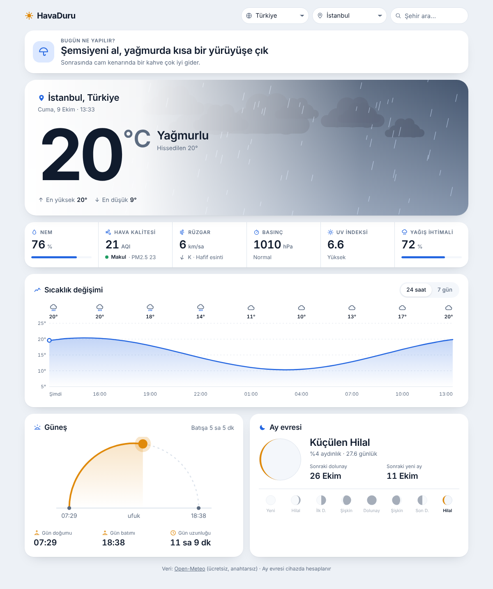

# HavaDuru

Tek dosyalık, modern bir hava durumu sitesi. Veriyi ücretsiz ve anahtarsız [Open-Meteo](https://open-meteo.com/) API'sinden canlı çeker.

## Özellikler

- Ülke ve şehir seçimi (Türkiye'den 38 il dahil 16 ülke) ve serbest şehir arama
- Hava durumuna göre değişen hareketli gökyüzü sahnesi: güneş, bulut, yağmur, şimşek, kar, sis, gece
- Hava ve dereceye göre "Bugün ne yapılır?" aktivite önerisi
- Nem, hava kalitesi (AQI), rüzgar, basınç, UV indeksi ve yağış ihtimali
- 24 saatlik ve 7 günlük sıcaklık grafiği
- Gün doğumu / gün batımı yayı ve ay evresi
- Açık ve koyu tema, telefon uyumlu

## Çalıştırma

Kurulum gerekmez. `index.html` dosyasını tarayıcıda açman yeterli.

## GitHub Pages ile yayınlama

1. Bu dosyaları deponun kök dizinine yükle.
2. Depoda **Settings → Pages** bölümüne gir.
3. **Source** olarak `Deploy from a branch`, dal olarak `main` ve klasör olarak `/ (root)` seç, kaydet.
4. Birkaç dakika sonra site `https://KULLANICI-ADIN.github.io/DEPO-ADI/` adresinde açılır.

## Dosyalar

| Dosya | Açıklama |
|---|---|
| `index.html` | Sitenin tamamı (HTML, CSS ve JavaScript tek dosyada) |
| `assets/ekran.png` | README için ekran görüntüsü |
| `.nojekyll` | GitHub Pages'in dosyaları olduğu gibi sunmasını sağlar |

## Veri kaynağı

- Hava tahmini: `api.open-meteo.com/v1/forecast`
- Hava kalitesi: `air-quality-api.open-meteo.com/v1/air-quality`
- Şehir arama: `geocoding-api.open-meteo.com/v1/search`

Open-Meteo ticari olmayan kullanım için ücretsizdir ve API anahtarı istemez. API'ye ulaşılamazsa sayfa, üstte belirterek örnek veri gösterir. Ay evresi cihazda hesaplanır.
